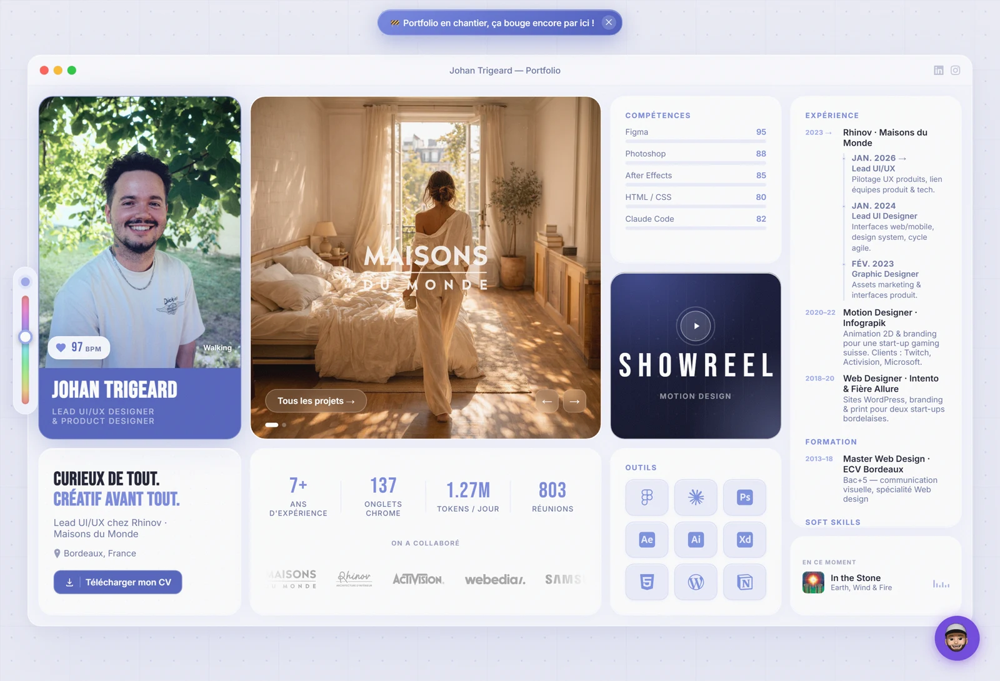

<h1 align="center">Johan Trigeard — Portfolio</h1>

<p align="center">
  Portfolio personnel de <strong>Johan Trigeard</strong>, Lead UI/UX &amp; Product Designer basé à Bordeaux.
</p>

<p align="center">
  <a href="https://edyhean.github.io/portfolio/"><strong>→ Voir le site</strong></a>
</p>

<p align="center">
  
</p>

---

## ✨ Le concept

Une interface façon **« OS de bureau »** : une fenêtre déplaçable et redimensionnable, une *bento grid* qui se réempile sur mobile, un accent colorimétrique réglable en direct, et une foule de détails vivants (BPM corrélé à l'heure de Bordeaux, statut d'activité, compteurs animés).

## 🧱 Stack

- **HTML / CSS / JavaScript vanilla** — zéro dépendance, zéro build
- Hébergé sur **GitHub Pages**

## 🎛 Au menu

- Bento grid responsive (desktop → tablette → mobile)
- Fenêtres macOS-like : drag, resize multi-bords, minimize / maximize
- Accent dynamique via un *hue slider*
- Pages projet : fenêtres flottantes sur desktop, *bottom sheet* sur mobile
- Showreel (lightbox Vimeo), chat widget memoji, mur de marques, lecteur musique
- Petites vies : BPM, statut, onglets Chrome, tokens/jour… qui évoluent tout seuls

## 🚀 En local

Aucun build nécessaire. Ouvrir `index.html` directement, ou servir le dossier :

```bash
python -m http.server 8000
# puis http://localhost:8000
```

## 📫 Me contacter

- **LinkedIn** — [in/hyrule-hero](https://www.linkedin.com/in/hyrule-hero/)
- **Instagram** — [@edyhean](https://www.instagram.com/edyhean/)
- **Mail** — johan.trigeard@gmail.com

---

<p align="center"><sub>© Johan Trigeard — tous droits réservés.</sub></p>
